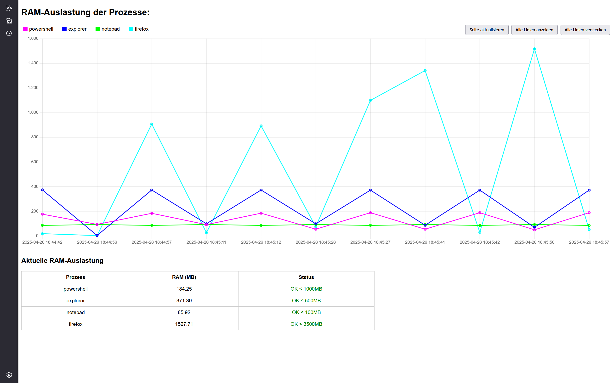

# AWSW-RAM-Monitor

AWSW RAM-Monitor for processes to watch their RAM usage

RAM Monitor - PowerShell Skript (FINAL)
---------------------------------------

Beschreibung:
Dieses Skript überwacht spezifische Prozesse und zeichnet deren RAM-Auslastung live auf.
Die Ergebnisse werden in einer CSV-Datei gespeichert und automatisch in einer HTML-Datei visualisiert.

Features:
- Live-Graph der RAM-Auslastung
- Individuelle RAM-Warnschwellen pro Prozess
- Automatische Aktualisierung der HTML-Seite (alle 30 Sekunden)
- Manuelle Buttons: Seite aktualisieren, Linien ein-/ausblenden
- Kompakte Legende + Tabelle mit Live-Daten
- Automatisches Browser-Öffnen nur wenn nötig
- Automatische Archivierung der CSV-Datei ab 10 MB
- Automatische Löschung alter Archivdateien (älter als 7 Tage)

Verwendung:
1. `ram_monitor_start.bat` starten.
2. Der Browser öffnet automatisch die Datei `ram_usage.html`.
3. Die Seite aktualisiert sich automatisch.

Dateien:
- ram_usage.csv         → Messdaten (wird automatisch erstellt)
- ram_usage.html        → Live-Graph (wird automatisch erstellt)
- Archiv\               → Archivierte CSV-Dateien (älter als 10MB)

Prozess Namen ermitteln in PowerShell mit:
Get-Process

