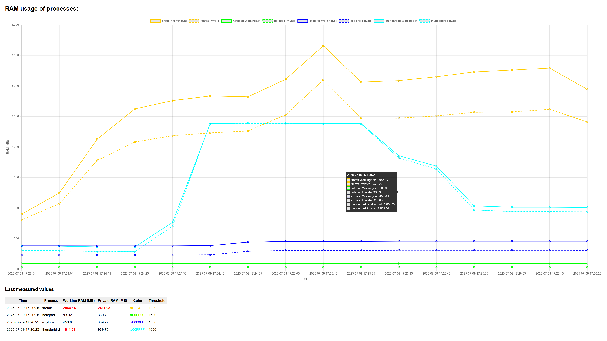

# AWSW-RAM-Monitor

RAM-Monitor to diplay the RAM usge of serveral processes in an automatically updated HTML dashboard.

Esay setup by adding one or more process(es) to the "RAM-Monitor.ps1" file. 
Choose a desired color and the threashold to each process you like to watch.
If the threashold is reached, the value is displayed red in the table below the Chart.

